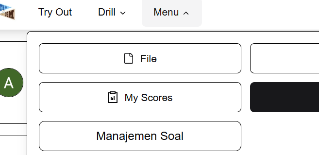
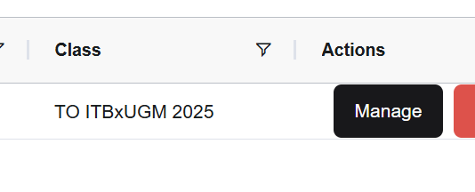
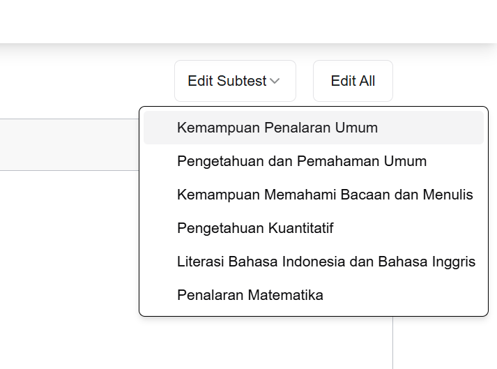
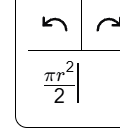
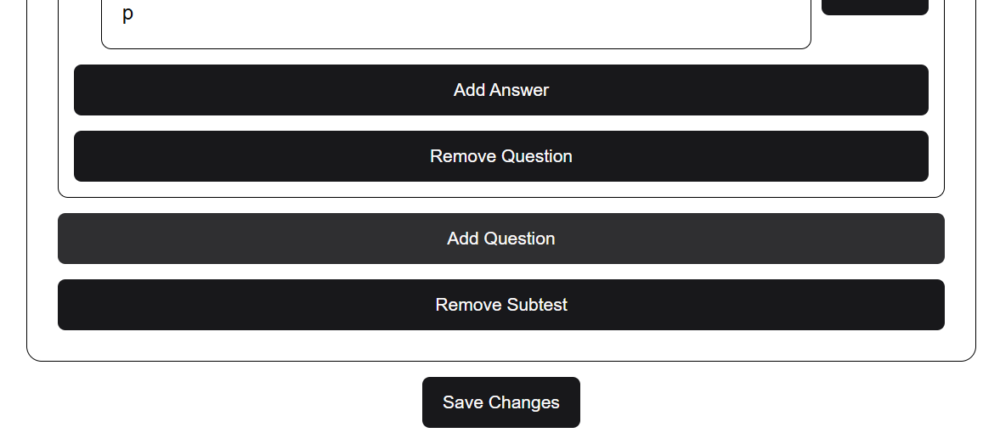

# TUTORIAL BUAT SOAL DI ITBJO.COM

- login pake email masing2 di [itbjo.com](https://itbjo.com)
- klik `Menu`
- klik `Manajemen Soal` (kalo ga ada, chat [081333729590](https://wa.me/6281333729590)/082146332165 sambil bilang email buat daftar apa)

- klik `MANAGE` di kolom actions baris 1

- klik `Edit Subtest`
- pilih subtest bagian klean

- tambahan: utk fungsi mtk bisa pake latex, caranya `$...$` cth `$\frac{\pi r^2}{2}$`

- **jgn klik `Remove Subtest`**

- kalo udh slese klik `Save Changes`
